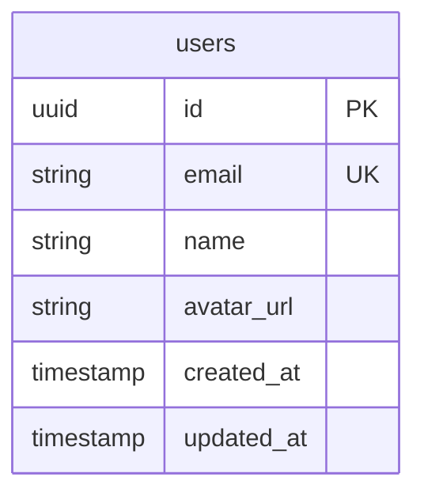

# データベース全体設計

## 概要

Supabase PostgreSQLを使用したデータベース設計です。

---

## ER図

---

## Prismaスキーマ

`prisma/schema.prisma` を参照してください。

---

## テーブル定義

### users

| カラム名 | 型 | NULL | デフォルト | 説明 |
|---------|-----|------|-----------|------|
| id | uuid | NO | uuid_generate_v4() | 主キー |
| email | varchar(255) | NO | - | メールアドレス（ユニーク） |
| name | varchar(100) | YES | NULL | 表示名 |
| avatar_url | text | YES | NULL | アバター画像URL |
| created_at | timestamptz | NO | now() | 作成日時 |
| updated_at | timestamptz | NO | now() | 更新日時 |

---

## インデックス

### users
- `users_pkey` (id) - PRIMARY KEY
- `users_email_key` (email) - UNIQUE

---

## RLS (Row Level Security)

`prisma/rls-policies.sql` を参照してください。

---

**最終更新日**: [日付]
